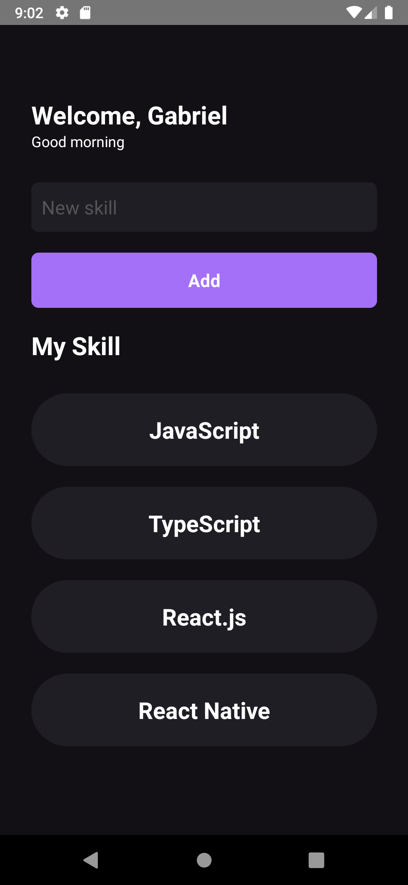

<p align="center">
  <a href="#technologies">Technologies</a>&nbsp;&nbsp;&nbsp;|&nbsp;&nbsp;&nbsp;
  <a href="#-layout">Getting started</a>&nbsp;&nbsp;&nbsp;|&nbsp;&nbsp;&nbsp;
  <a href="#-project">Project</a>&nbsp;&nbsp;&nbsp;|&nbsp;&nbsp;&nbsp;
  <a href="#-layout">Layout</a>&nbsp;&nbsp;&nbsp;|&nbsp;&nbsp;&nbsp;
  <a href="#-license">License</a>
</p>

<br>

<p align="center">
  
</p>

---

## 🧪 Technologies

This project was developed using the following technologies:

-   [React Native](https://reactnative.dev/)
-   [TypeScript](https://www.typescriptlang.org/)

## 🚀 Getting started

Clone the project and access the folder

```bash
$ git clone https://github.com/gabrielvrl/myskills && cd myskills
```

Follow the steps below

```bash
# Install the dependencies
$ yarn

# Start the project
$ yarn start

# Run the emulator
$ yarn android
or
$ yarn ios
```

## 📝 License

This project is licensed under the MIT License. See the [LICENSE](LICENSE.md) file for details.
